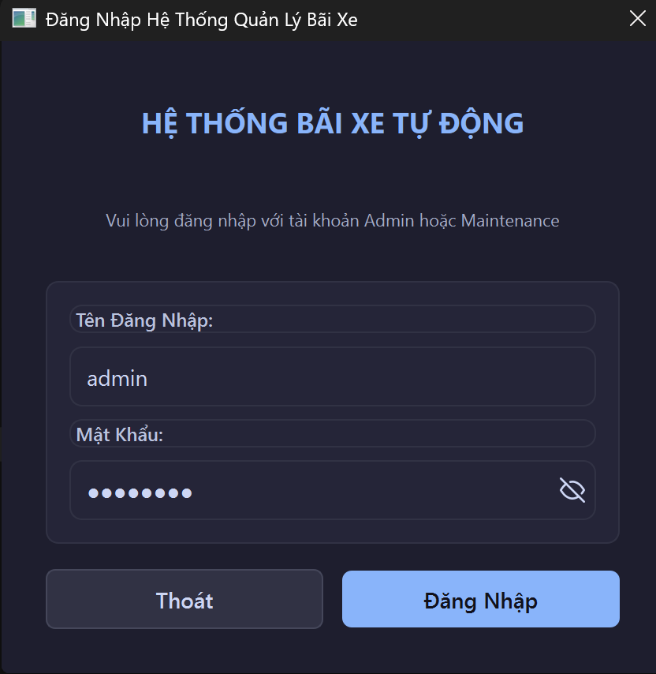
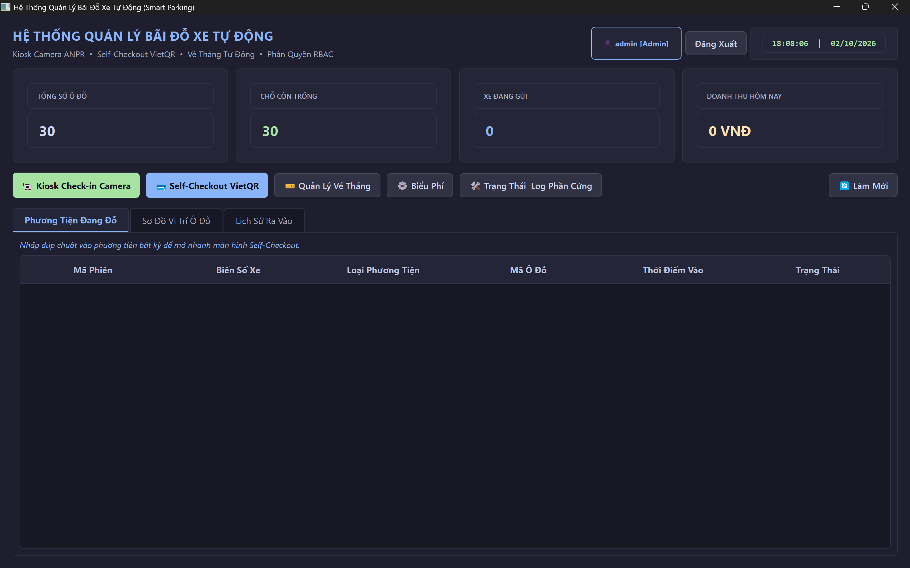
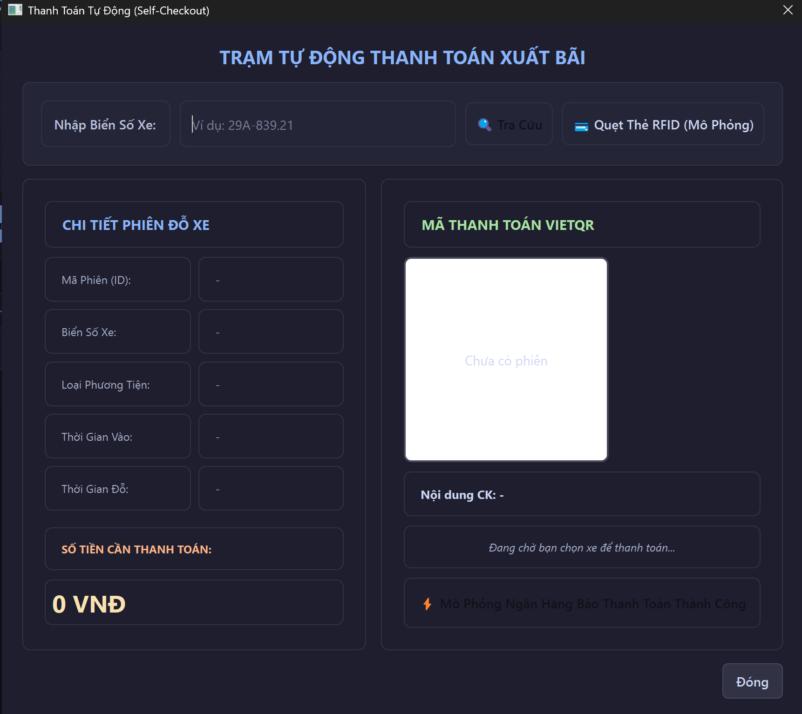
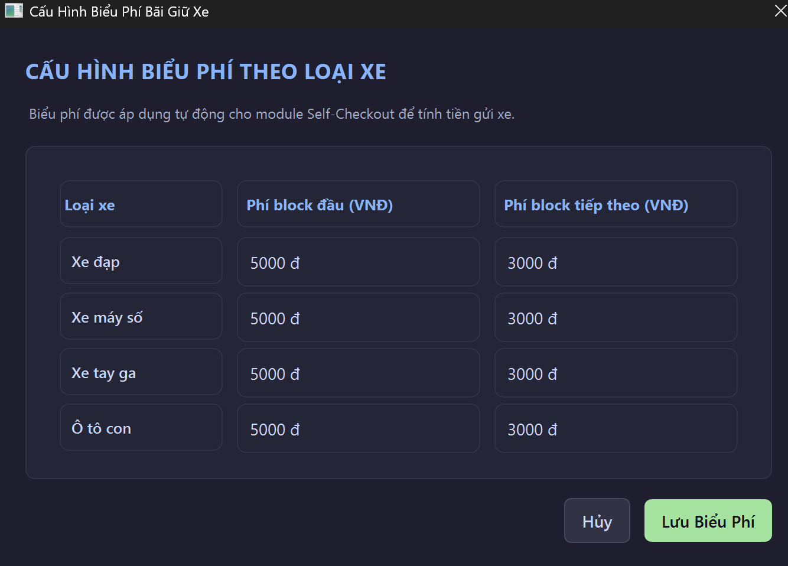

# 🅿️ Hệ Thống Quản Lý Bãi Giữ Xe Thông Minh

> Phần mềm desktop quản lý bãi giữ xe tự động, xây dựng bằng **C++17**, **Qt 6.11**, **SQLite** và **CMake**.  
> Kiến trúc MVC, áp dụng các Design Pattern: Strategy, Repository, Singleton, Factory.

[](LICENSE)
[](https://isocpp.org/)
[](https://www.qt.io/)

---

## 📸 Ảnh Màn Hình

<!-- Thêm ảnh vào thư mục docs/screenshots/ rồi uncomment các dòng dưới -->

| Màn hình Đăng nhập | Dashboard chính | Cổng tự động (Kiosk) |
|---|---|---|
|  |  |  |

| Tự thanh toán | Cấu hình biểu phí | Lịch sử xe ra vào |
|---|---|---|
|  |  |  |

---

## ✨ Tính Năng Chính

### 🔐 Đăng nhập & Phân quyền
- Màn hình đăng nhập có hiện/ẩn mật khẩu (nút con mắt trong ô nhập)
- Hai vai trò: **Admin** (toàn quyền) và **Maintenance** (chỉ xem nhật ký bảo trì)
- Mật khẩu được hash SHA-256 trước khi lưu vào SQLite

### 🚗 Quản lý 4 Loại Xe
| Loại xe | Enum | Phí block đầu | Phí block tiếp theo |
|---|---|---|---|
| Xe đạp | `Bicycle (0)` | 2.000 đ | 1.000 đ |
| Xe máy số | `MotorbikeManual (1)` | 4.000 đ | 2.000 đ |
| Xe tay ga | `MotorbikeScooter (2)` | 5.000 đ | 3.000 đ |
| Ô tô con | `Car (3)` | 25.000 đ | 15.000 đ |

> Biểu phí có thể chỉnh qua giao diện Admin, lưu vào SQLite, không cần sửa code.

### 🏗️ Bãi Đỗ Xe
- **20 chỗ xe máy/xe đạp**: M-01 → M-20
- **10 chỗ ô tô**: C-01 → C-10
- Tự động tìm chỗ trống khi check-in, cảnh báo khi hết chỗ

### 📷 Cổng Tự Động (Kiosk Mode)
- `KioskGateDialog`: màn hình toàn cảnh cho nhân viên/khách tự thao tác
- `CameraService` + `ANPRService`: khung nhận diện biển số (mock, sẵn sàng tích hợp OpenCV)
- `HardwareController`: giao tiếp barrier qua `QSerialPort`
- `AutoGateManager`: điều phối toàn bộ luồng vào/ra tự động

### 💳 Self-Checkout (Tự Thanh Toán)
- Nhập biển số → tra cứu phiên đỗ xe → tính phí tự động
- Hiển thị QR code mô phỏng thanh toán
- `BankWebhookSimulator`: giả lập callback xác nhận thanh toán

### 📅 Vé Tháng
- Đăng ký vé tháng theo biển số, lưu `MonthlyPasses`
- Trong thời hạn hiệu lực: vào/ra miễn phí (0 đ)
- Hết hạn → tự động tính theo giờ

### 📊 Dashboard & Lịch Sử
- Thống kê thời gian thực: số xe đang đỗ, tỷ lệ lấp đầy, doanh thu trong ngày
- Bảng theo dõi xe đang trong bãi (double-click để thanh toán nhanh)
- Widget tra cứu lịch sử xe ra vào theo biển số

### 🔧 Nhật Ký Bảo Trì
- `MaintenanceLogDialog`: ghi và xem lịch sử bảo dưỡng thiết bị

---

## 🏛️ Kiến Trúc & Design Patterns

```
┌─────────────┐     Signal/Slot      ┌──────────────────┐
│   UI Layer  │ ◄──────────────────► │  Service Layer   │
│  (Qt Widgets)│                      │  (Business Logic)│
└─────────────┘                      └────────┬─────────┘
                                              │
                                    ┌─────────▼─────────┐
                                    │  Repository Layer │
                                    │  (SQLite / Qt Sql)│
                                    └───────────────────┘
```

| Pattern | Nơi áp dụng |
|---|---|
| **Strategy** | `IPricingStrategy` → `HourlyPricingStrategy`, `MonthlyPassStrategy` |
| **Repository** | `ParkingRepository` tách SQL khỏi business logic |
| **Singleton** | `DatabaseManager::instance()`, `SessionManager::instance()` |
| **MVC** | UI (`*Dialog`, `*Widget`) không chứa SQL hay logic tính tiền |

---

## 🗂️ Cấu Trúc Thư Mục

```
ParkingManagementSystem/
├── CMakeLists.txt
├── LICENSE
├── README.md
├── resources/
│   ├── app.qrc
│   ├── icons/
│   │   ├── eye_open.svg       # Icon hiện mật khẩu
│   │   └── eye_off.svg        # Icon ẩn mật khẩu
│   └── styles/
│       └── dark_theme.qss     # Dark Mode stylesheet
├── docs/
│   └── screenshots/           # ← Bạn thêm ảnh vào đây
└── src/
    ├── main.cpp
    ├── models/                 # Dữ liệu thuần (không phụ thuộc Qt)
    │   ├── VehicleType.h       # Enum VehicleType, SlotType, VehicleUtils
    │   ├── Vehicle.h / .cpp    # Abstract base + concrete vehicles
    │   ├── ParkingSlot.h
    │   ├── Ticket.h
    │   ├── PricingConfig.h
    │   ├── PricingModel.h / .cpp
    │   ├── ParkingSession.h
    │   ├── MonthlySubscription.h
    │   ├── MonthlyPass.h
    │   └── User.h
    ├── strategies/             # Strategy Pattern: tính phí
    │   ├── IPricingStrategy.h
    │   ├── HourlyPricingStrategy.h / .cpp
    │   └── MonthlyPassStrategy.h / .cpp
    ├── db/                     # Tầng CSDL
    │   ├── DatabaseManager.h / .cpp   # Singleton, tạo bảng, seed data
    │   └── ParkingRepository.h / .cpp # CRUD với Prepared Statements
    ├── services/               # Business Logic
    │   ├── PricingService.h / .cpp
    │   ├── ParkingManager.h / .cpp
    │   ├── SessionManager.h / .cpp    # Xác thực, phân quyền
    │   ├── CameraService.h / .cpp     # Khung camera (OpenCV-ready)
    │   ├── ANPRService.h / .cpp       # Nhận diện biển số (mock)
    │   ├── HardwareController.h / .cpp # Barrier qua QSerialPort
    │   ├── AutoGateManager.h / .cpp   # Điều phối cổng tự động
    │   └── BankWebhookSimulator.h / .cpp
    └── ui/                     # Giao diện người dùng
        ├── MainWindow.h / .cpp
        ├── LoginDialog.h / .cpp
        ├── CheckInDialog.h / .cpp
        ├── CheckOutDialog.h / .cpp
        ├── KioskGateDialog.h / .cpp   # Kiosk Mode
        ├── SelfCheckoutDialog.h / .cpp
        ├── MonthlyPassDialog.h / .cpp
        ├── PricingAdminDialog.h / .cpp
        ├── SubscriptionDialog.h / .cpp
        ├── MaintenanceLogDialog.h / .cpp
        └── HistoryWidget.h / .cpp
```

---

## 🖥️ Yêu Cầu Hệ Thống

| Thành phần | Phiên bản |
|---|---|
| OS | Windows 10/11 64-bit |
| Qt | 6.11.x (MinGW 64-bit) |
| Compiler | MinGW 13.1.0 (đi kèm Qt) hoặc MSVC 2022 |
| CMake | ≥ 3.16 |
| SQLite | Đi kèm Qt (QtSql/QSQLITE driver) |

---

## ⚙️ Cách Build

### Cách 1 — Qt Creator (khuyên dùng)
1. Mở Qt Creator → **Open File or Project** → chọn `CMakeLists.txt`
2. Chọn Kit: `Desktop Qt 6.11.x MinGW 64-bit`
3. Nhấn **Run** (`Ctrl+R`)

### Cách 2 — Dòng lệnh (PowerShell)
```powershell
# Cấu hình
cmake -B build -S . -G "MinGW Makefiles" `
      -DCMAKE_BUILD_TYPE=Debug

# Build
cmake --build build -j4

# Chạy (file .exe được copy vào App/ tự động)
.\App\ParkingManagementSystem.exe
```

> **Lưu ý**: CMakeLists.txt đã hard-code đường dẫn compiler tại  
> `C:/Qt/Tools/mingw1310_64/bin/g++.exe`. Nếu cài Qt vào thư mục khác,  
> sửa 2 dòng `set(CMAKE_C_COMPILER ...)` và `set(CMAKE_CXX_COMPILER ...)`.

---

## 🚀 Tài Khoản Demo

| Username | Mật khẩu | Vai trò | Quyền |
|---|---|---|---|
| `admin` | `admin123` | Admin | Toàn bộ chức năng |
| `tech` | `tech123` | Maintenance | Xem nhật ký bảo trì |

> Tài khoản được seed tự động khi chạy lần đầu. Mật khẩu lưu dạng SHA-256 hash.

---

## 🗄️ Cơ Sở Dữ Liệu

File `parking_system.db` (SQLite) được tạo tự động cạnh file `.exe`.

| Bảng | Mô tả |
|---|---|
| `Users` | Tài khoản, hash mật khẩu, vai trò |
| `pricing_config` | Biểu phí 4 loại xe (có thể chỉnh qua Admin) |
| `ParkingSessions` | Phiên gửi xe (check-in/out, biển số, phí) |
| `MonthlyPasses` | Vé tháng (tên khách, biển số, hạn dùng) |
| `parking_slots` | 30 chỗ đỗ (M-01…M-20, C-01…C-10) |
| `tickets` | Vé lượt (tương thích ngược sơ đồ bãi) |
| `monthly_subscriptions` | Đăng ký vé tháng legacy |

---

## 🔭 Hướng Phát Triển Tiếp Theo

- [ ] Tích hợp OpenCV thật cho ANPR (nhận diện biển số từ camera RTSP)
- [ ] Kết nối QSerialPort thật để điều khiển barrier vật lý
- [ ] Tích hợp cổng thanh toán thật (VNPay, MoMo webhook)
- [ ] Báo cáo doanh thu theo ngày/tuần/tháng (export Excel/PDF)
- [ ] Thông báo SMS/email khi vé tháng sắp hết hạn
- [ ] Hỗ trợ đa bãi xe (multi-location)
- [ ] Unit tests cho tầng service và repository

---

## 📄 Giấy Phép

Dự án được phát hành theo giấy phép [MIT](LICENSE).
